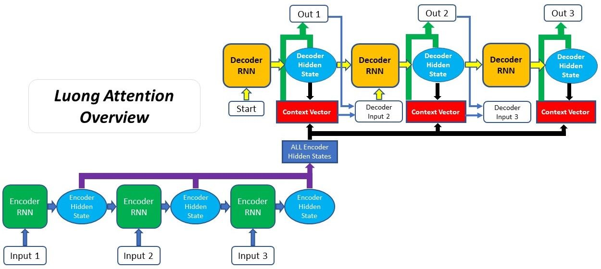

# Machine Translation System

### To start the server 

To start server kindly use following command, 

```bash
 python startAPI.py --config configFile --ip ipAddress --port portNumber
```
Small description of fields is given below,

| Field  | Field Description                                                                                                                                    |
|--------|------------------------------------------------------------------------------------------------------------------------------------------------------|
| config | Json configuration file which contains path to translation model and values of hyper-parameters like using GPU, beamSize etc. Default: mtConfig.json |
| ip     | ip Address which will be exposed as server. Default: 0.0.0.0                                                                                         |
| port   | port used for handling translation request. Default: 5000                                                                                            |

### Prerequisite for Server
	
	- Opennmt package
	- Flask
	

### Short Description of Service

Machine Translation system is a program/model for translating from source language (e.g. English) to target language (e.g. Hindi). There are multiple ways of making such a system e.g. rule based, data driven techniques which make use of ML algorithms, hybrid systems unifying both rule based and data driven based techniques. We have used ML based models for building MT systems for translating English to Hindi or Bhojpuri. 

### Resources Used to Make MT Systems

#### For Training Machine Translation system

We used [Opennmt](https://github.com/OpenNMT/OpenNMT-py) package to train Neural Machine Translation models. And [Flask](https://github.com/pallets/flask) package for providing APIs for translation service.

#### Data Resources
Models provided as serivce are trained on 2 language pairs English ==> {Hindi, Bhojpuri} using following datasets

- [English Hindi Parallel Corpus v2.1](http://www.cfilt.iitb.ac.in/iitb_parallel/)

- [English Bhojpuri Parallel Corpus](https://sites.google.com/view/loresmt)

#### System Architectures Used

Two architectures were used for training translation models - Attention and Transformer model. For English to Hindi translation model we used both aforementioned models. And for English to Bhojpuri only Attention model was used, since its dataset was very small. And transformer requires more instance to learn translation when compared to attention. Given below is small description of these models, for more comprehensive literature kindly go through reference section.

- **Attention Architecture**: This works in conjuction with sequence to sequence neural network architecture for translation. It identifies (paying attention to) and scores the most important word in source language to be used while decoding (translating) a particular word in target language. While scoring attention network takes in the source sentence and previous word generated in target sentence. There are mainly two flavours of this kind of attention which are named after first Authors of respective papers - Bahdanau Attention and Luong Attention. Main difference betweem two is how they decode after identifying and scoring most important word 
	
	- Bahdanau Attention 
	
	
	
	- Luong Attention
	
	
	
In models trained we made use of Luong Attention.
	
- **Transformer Architecture**: Makes use of multiple attention networks for a source sentence, each of these attention network has same sentence sentence giving attention to all the words in it - self-attention. This architecture transforms each word in a sentence in different embedding space, where each transformation is contextualized based on other words in sentence.

	

*These three images are taken from [here](https://blog.floydhub.com/attention-mechanism/)*

### Usage of MT service

We made use of flask and opennmt to create [RESTful API](https://www.mulesoft.com/resources/api/what-is-rest-api-design) services which can be called for translating a text in source language (English) into target language (Hindi, Bhojpuri). API takes in a JSON object, which consist of source sentence ("src") and model ("id") to be used for translation. 

Example Usage:
	
	curl -i -X POST -H "Content-Type: application/json" -d '[{"src": "INSERT ENGLISH SENTENCE HERE", "id": MODEL_ID}]' http://8ea2b9ff.ngrok.io/translate
	
Input Parameters : Json (src,id)

	| Field | Type    | Description                                                         |
	|-------|---------|---------------------------------------------------------------------|
	| src   | String  | Source sentence which has to be translated.                         |
	| id    | Integer | Ids refer to each translation model which can be used to translate. |
	
Output : Json File (src, tgt, errorMessage)

	| Field        | Type   | Description                                                                     |
	|--------------|--------|---------------------------------------------------------------------------------|
	| src          | String | Source sentence which has to be translated.                                     |
	| tgt          | String | Sentence Translated from 'src' source sentence and translated using model 'id'. |
	| errorMessage | String | Contains error message, if any.                                                 |

Models available right now,

	| Model ID | Model Description                                                    |
	|----------|----------------------------------------------------------------------|
	| 100      | English Hindi Translation System using NMT with Attention Network    |
	| 101      | English Hindi Translation System using Transformer Network           |
	| 102      | English Bhojpuri Translation System using NMT with Attention Network |

##### To add more translation systems

This translation system can be extended by adding more translation models. Models trained using opennmt package are saved with '.pt' extension. And these models are added to mtConfig.json configuration file in json dictionary format with following fields,
	
	| Field            | Field Description                                             |
	|------------------|---------------------------------------------------------------|
	| id               | Model id to be used to denote translation system              |
	| model            | Path to model                                                 |
	| timeout          | Seconds before freeing the GPU space                          |
	| on_timeout       | Where to move server model                                    |
	| opt[gpu]         | GPU id to be used for server, -1 for not using GPU            |
	| opt[batch_size]  | Batch size of input                                           |
	| opt[beam_size]   | Beam size for decoding                                        |
	| opt[replace_unk] | Replace a token not translated by most attentive source token |
	
	e.g.
```json
	{
	    "id": 100,
	    "model": "nmtWithAttention.pt",
	    "timeout": 60000,
	    "on_timeout": "to_cpu",
	    "load": true,
	    "opt": {
		"gpu":-1,
		"batch_size": 1,
		"beam_size": 10,
		"replace_unk": true
	    }
	}
```

### References

- Packages
	- [Opennmt](https://opennmt.net/OpenNMT-py/)
	- [Flask](https://flask.palletsprojects.com/en/1.1.x/)
- Datasets
	- [The IIT Bombay English-Hindi parallel corpus](http://www.cfilt.iitb.ac.in/iitb_parallel/)
	- [English Bhojpuri parallel corpus](https://sites.google.com/view/loresmt)
- Papers
	- [The IIT Bombay English-Hindi parallel corpus](https://arxiv.org/pdf/1710.02855.pdf)
	- [Neural machine translation by jointly learning to align and translate](https://arxiv.org/pdf/1409.0473.pdf)
	- [Attention Is All you Need](https://papers.nips.cc/paper/7181-attention-is-all-you-need.pdf)
	- [A3-108 Machine Translation System for LoResMT 2019](https://www.aclweb.org/anthology/W19-6810.pdf)
	- [BLEU: a method for automatic evaluation of machine translation](http://www.cs.cmu.edu/~jeanoh/16-785/papers/papineni-acl2002-bleu.pdf)
- Blogs
	- [For NMT with Attention](https://blog.floydhub.com/attention-mechanism/)
	- For Transformer [blog1](http://jalammar.github.io/illustrated-transformer/) and [blog2](https://blog.floydhub.com/the-transformer-in-pytorch/)

