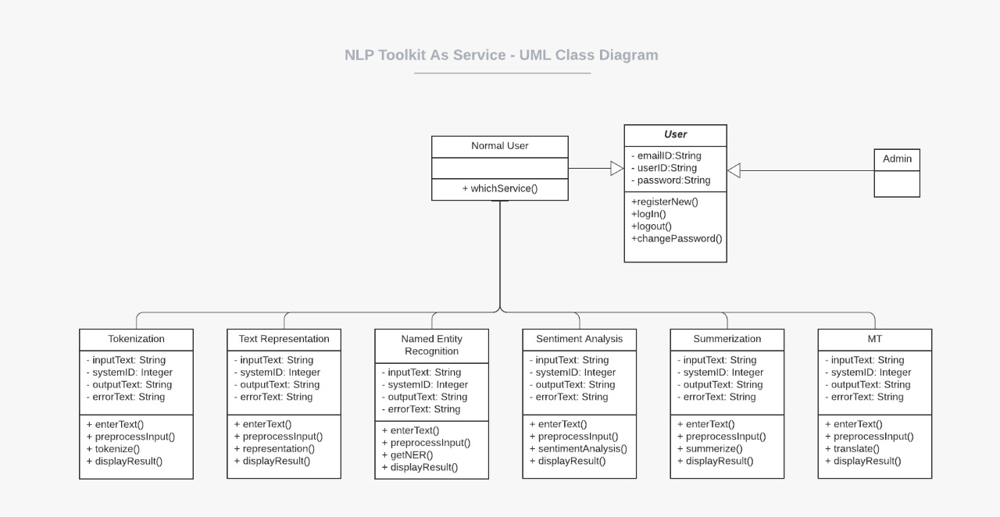

  <b>CSE 461 Software Engineering</b>   
  <a>Spring 2020</a> 
  <a>IIIT Hyderabad</a>  
  <b><u>Course Project: NLP toolkit as a service</u></b></a>
    
  <b>Team 8</b> 
  <a>Saumitra Yadav | </a><a>Neha Motlani | </a><a>Sunil Gundapu</a> 
  <a>Ananya Mukherjee | </a><a>Prashant Kodali | </a><a>Hiranmai Sri Adibhatla</a>   
  
  [Project Abstract](Team%208%20SWE%20Project%20-%20Project%20Abstract.pdf) | [Project High Level Design](Team%208%20SWE%20Project%20-%20High%20Level%20Design.pdf)

### Project Overview:
Due to the inherent nature of the field of NLP, any application development or research projects, involves trying out multiple algorithms / models. Trying out these algorithms can involve lots of work, and if everybody is doing it, it is lot of double work. And, if someone is low on compute resources, it restricts a programmer from exploring those models or algorithms.

To address this problem, our team set out on developing a platform which enables users to share and acess this knowledge within an institution and across teams.

### Components:
- [Frontend](frontend/):
  - for hosting details regarding all the services available.
  - for developers to try a particular service
  - A place to gather details of the APIs that developer can hit to access these services, if he/she intends to use these services in their application.
  - Allows developers to publish their applications/services.

- Individual services:
  - developed and published by developers.
  - individual services are run and hosted by the individuals. the frontend doesn't involve hosting a service.
  - Following services have been implemented and integrated with frontend by our Team
    - [Tokenization](Tokenizer/)
    - [Text Representations](TextEmbeddings/)
    - [Named Entity Recongniation](NER/)
    - [Sentiment Analysis](Sentiment%20Analysis/)
    - [Summarization](Summarization/)
    - [Machine Translation](MT/)
    
    Please access these individual pages for more details on each of these pages.

### System Architecture

#### UML Class Diagram

UML class diagram for giving an abstract idea and describing static structure of 'NLP toolkit as a service' project is given below. It shows classes, their attributes, operations and relationships among objects.

Normal User and Admin are inherited from class USER. whichService() method of Normal User is used to call objects of services as APIs to do certain jobs and these services have an association relationship with Normal User.
